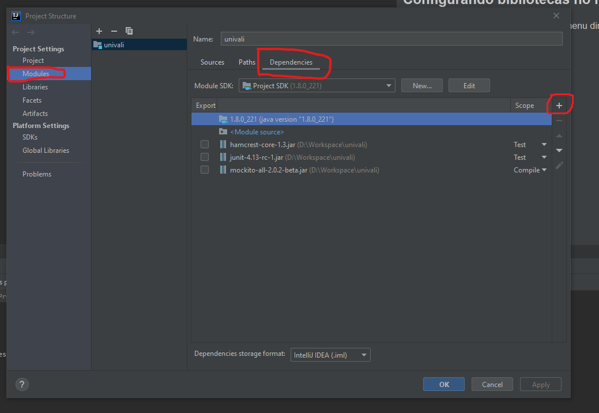

# Exercícios UNIVALI

## Configurando ambiente no IntelliJ

### Configurando bibliotecas no intelliJ

* Clique sobre o módulo "univali" no menu direito e pressione F4 ou botão direito e "Open module settings".
* No "Project structure", no menu direito clique em Project Settings >> Modules.
* Clique na aba "Dependencies".
* Clique em "+" e escolha a opção "jars or directories".
* Coloque todos os jars dentro desse diretório.

### Contato
LinkedIn: https://www.linkedin.com/in/jefersonperito
e-mail: jefperito@gmail.com
